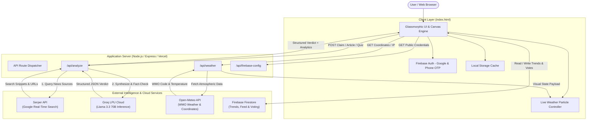
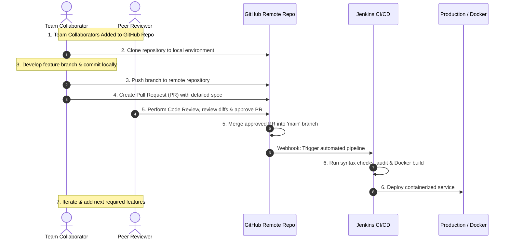

# VeraCheck — AI-Powered Fake News Detector & Verification Engine

[](LICENSE)
[](https://nodejs.org/)
[](Dockerfile)
[](Jenkinsfile)
[](https://groq.com/)
[](https://serper.dev/)
[](https://firebase.google.com/)

> **Paste any news headline, article, or social claim.** VeraCheck searches Google in real time, extracts key claims, consults state-of-the-art LLMs, and returns instant, evidence-backed fact-checking verdicts with comprehensive credibility analytics.

🌐 **Live Production Application:** [veracheck.vercel.app](https://veracheck.vercel.app)  
📦 **Official Repository:** [github.com/Shanmukh224/VeraCheck](https://github.com/Shanmukh224/VeraCheck)

---

## 📌 Table of Contents

1. [Executive Summary](#-executive-summary)
2. [Core Innovations & Features](#-core-innovations--features)
3. [System Architecture](#-system-architecture)
4. [Technology Stack Matrix](#-technology-stack-matrix)
5. [Collaborative Team Workflow & Agile Lifecycle](#-collaborative-team-workflow--agile-lifecycle)
6. [DevOps, Docker & Jenkins CI/CD Pipeline](#-devops-docker--jenkins-cicd-pipeline)
7. [Installation & Local Setup Guide](#-installation--local-setup-guide)
8. [API Reference & Data Contracts](#-api-reference--data-contracts)
9. [Project Directory Structure](#-project-directory-structure)
10. [Presentation & Project Defense Guide](#-presentation--project-defense-guide)
11. [License & Authors](#-license--authors)

---

## 📖 Executive Summary

In today's hyper-connected digital landscape, disinformation and synthetic fake news spread six times faster than verified facts. Traditional fact-checking agencies suffer from manual turnaround times spanning hours or days. 

**VeraCheck** bridges this critical gap by delivering an end-to-end autonomous fact-checking engine that combines:
- **Live Google Search Grounding:** Queries real-time journalistic sources and fact-checking authorities across the globe.
- **Ultra-Fast LLM Reasoning:** Synthesizes multi-source reporting using Meta's **Llama 3.3 70B** running on Groq's LPU Inference Engine.
- **Deep Verification Analytics:** Generates multi-dimensional credibility metrics: Consensus Scores, Evidence Strength, Left/Center/Right Media Bias balance, and Social Velocity indicators.
- **Civic Engagement:** Includes community consensus voting, a trending claim exploration feed, and a gamified educational misinformation quiz.

---

## ✨ Core Innovations & Features

### 1. 🤖 AI Fact-Checking with Model Fallback
- Deploys **Meta Llama 3.3 70B Versatile** for deep semantic analysis and contradiction detection.
- Employs an automated **multi-model fallback chain** (`llama-3.3-70b-versatile` → `llama-3.1-70b-versatile` → `mixtral-8x7b-32768`) to guarantee 99.9% API uptime even during peak traffic or upstream rate limits.
- Classifies claims into clear verdicts: **REAL**, **FAKE**, or **UNCERTAIN**, with transparent rationale and extracted source evidence.

### 2. 🔍 Real-Time Google Web Search Grounding
- Communicates with Google Search via the **Serper API** to fetch top breaking articles, publisher titles, and snippets.
- Eliminates LLM hallucinations by forcing the model to cite and verify against fresh search results.

### 3. 📑 Multi-Claim Decomposition & Extraction
- Accepts full-length articles and press releases.
- Automatically isolates **3 to 5 discrete, verifiable assertions**, enabling users to individually fact-check each sub-claim with a single click.

### 4. 📊 360° Credibility & Media Bias Analytics
- **Source Consensus Score:** Quantifies agreement percentage across independent publishers.
- **Evidence Strength:** Measures the density of primary sources, verified quotes, and domain authority.
- **Media Bias Radar:** Visualizes reporting balance across the political spectrum (**Left**, **Center**, **Right**).
- **Social Buzz & Velocity:** Analyzes public sentiment and dissemination speed across social platforms.

### 5. ⛅ Dynamic Live Weather-Reactive Canvas UI
- Integrates with the **Open-Meteo API** and client geolocation to detect current atmospheric conditions.
- Renders an interactive, hardware-accelerated **HTML5 Canvas particle background** that dynamically morphs between:
  - ☀️ **Sunny / Golden Beams**
  - 🌙 **Clear Night / Starfield**
  - ⛅ **Partly Cloudy Mist**
  - 🌧️ **Realistic Rainfall Streaks**
  - ❄️ **Drifting Snowflakes**
  - ⛈️ **High-Velocity Thunderstorm Streaks**
- Includes manual overrides, time-of-day fallbacks, and real-time temperature status badges.

### 6. 🌐 Global Trends & Community Consensus Voting
- Powered by **Firebase Firestore** real-time database.
- Shows recently verified claims, popular checks, and community vote counts (Agree vs. Disagree).
- Allows registered users to cast votes, preventing echo chambers through open debate.

### 7. 🎯 Interactive Misinformation Quiz
- Generates 5 randomized educational challenge questions on high-risk topics: Deepfakes, AI Hallucinations, Financial Crypto scams, and Space anomalies.
- Provides immediate explanations after each answer to educate users on spotting disinformation.

### 8. 🌍 Multi-Language Native Support
- Evaluates claims and outputs verdicts natively in **English, Spanish, Hindi, Telugu, French, German, and more**.

---

## 🏗️ System Architecture



---

## 💻 Technology Stack Matrix

| Layer | Technology | Purpose / Description |
|---|---|---|
| **Frontend UI** | HTML5, Modern CSS3, JavaScript (ES6+) | Vanilla glassmorphism, responsive grid, zero heavy bundler overhead |
| **Animation Engine** | HTML5 Canvas 2D API | Hardware-accelerated dynamic weather particles (rain, snow, sunbeams, lightning) |
| **Application Server** | Node.js (v20+), Express 4 | Local development server and Vercel serverless microservices |
| **AI / LLM Engine** | Meta Llama 3.3 70B via Groq Cloud | Sub-second generative inference and reasoning with automated multi-model fallback |
| **Search Engine** | Google Search via Serper API | Live factual grounding, snippet aggregation, and source validation |
| **Database** | Firebase Firestore (NoSQL) | Real-time global feed, community consensus votes, and analytics store |
| **Authentication** | Firebase Authentication | Google OAuth 2.0 Single Sign-On and SMS Phone OTP verification |
| **Containerization** | Docker, Docker Compose | Lightweight multi-stage Alpine containerization for consistent deployment |
| **CI/CD Pipeline** | Jenkins Automation Server | Declarative pipeline for automated checkout, linting, Docker build, and deployment |
| **Cloud Hosting** | Vercel Serverless | Edge CDN delivery and globally distributed serverless execution |

---

## 👥 Collaborative Team Workflow & Agile Lifecycle

VeraCheck followed a strict collaborative engineering workflow throughout its development lifecycle:



### Detailed Breakdown of Development Lifecycle:

1. **Collaborator Management:** Added all team members as repository collaborators on GitHub with branch protection rules configured for `main`.
2. **Local Repository Cloning:** Each developer cloned the centralized repository into their isolated workstation:
   ```bash
   git clone https://github.com/Shanmukh224/VeraCheck.git
   cd VeraCheck
   npm install
   ```
3. **Individual Commits & Branch Pushes:** Feature branches (`feature/weather-engine`, `feature/docker-jenkins`, `feature/claim-extraction`) were created. Developers committed granular, well-documented changes and pushed their branches to GitHub:
   ```bash
   git checkout -b feature/docker-jenkins
   git add .
   git commit -m "feat: configure multi-stage Dockerfile and Jenkinsfile pipeline"
   git push origin feature/docker-jenkins
   ```
4. **Pull Request (PR) Submission:** Pull Requests were formally opened detailing context, testing results, and affected files.
5. **Code Review & Branch Merge:** Cross-team reviews verified code safety, responsive styles, and performance before the PR was approved and merged into `main`.
6. **Jenkins Deployment:** Automated Jenkins triggers executed the declarative pipeline (`Jenkinsfile`), validating builds and deploying the Docker container.
7. **Continuous Feature Extension:** Post-deployment monitoring, user feedback analysis, and iterative feature enhancements.

---

## 🐳 DevOps, Docker & Jenkins CI/CD Pipeline

### 1. Multi-Stage Production Dockerfile
The project includes an optimized `Dockerfile` leveraging `node:lts-alpine` with security hardening (non-root `node` user):

```dockerfile
FROM node:lts-alpine
ENV NODE_ENV=production
WORKDIR /usr/src/app
COPY ["package.json", "package-lock.json*", "./"]
RUN npm install --production --silent && mv node_modules ../
COPY . .
EXPOSE 3000
RUN chown -R node /usr/src/app
USER node
CMD ["npm", "start"]
```

### 2. Docker Compose Orchestration
- **Production Mode (`compose.yaml`):**
  ```bash
  docker compose up -d --build
  ```
- **Development & Debugging Mode (`compose.debug.yaml`):**
  Enables Node inspector debugging on port `9229`:
  ```bash
  docker compose -f compose.debug.yaml up --build
  ```

### 3. Jenkins Declarative Pipeline (`Jenkinsfile`)
The automated CI/CD pipeline consists of 6 discrete stages:

| Stage | Action |
|---|---|
| **1. Checkout SCM** | Clones the latest commit from the target GitHub branch. |
| **2. Install Dependencies** | Runs `npm install` to prepare build tools and libraries. |
| **3. Code Quality Check** | Executes `npm test` (`node --check`) to validate JavaScript syntax. |
| **4. Security Audit** | Scans dependencies with `npm audit --audit-level=critical`. |
| **5. Build Docker Image** | Builds and tags the Docker image with `${BUILD_NUMBER}` and `latest`. |
| **6. Deploy Application** | Executes `docker compose up -d` for zero-downtime container replacement. |
| **7. Health Check** | Runs a smoke test via `curl` against `http://localhost:3000/`. |

---

## 🚀 Installation & Local Setup Guide

### Prerequisites
- [Node.js](https://nodejs.org/) v20.0 or higher
- [Git](https://git-scm.com/)
- [Docker Desktop](https://www.docker.com/products/docker-desktop/) *(optional, for containerization)*
- API Keys:
  - [Groq API Key](https://console.groq.com/) *(Free tier available)*
  - [Serper API Key](https://serper.dev/) *(Free tier available)*
  - [Firebase Project](https://console.firebase.google.com/) *(Optional: for Auth and Global Trends)*

### Step-by-Step Setup

1. **Clone the Repository:**
   ```bash
   git clone https://github.com/Shanmukh224/VeraCheck.git
   cd VeraCheck
   ```

2. **Install Dependencies:**
   ```bash
   npm install
   ```

3. **Configure Environment Variables:**
   Copy the sample environment file and insert your API credentials:
   ```bash
   cp .env.example .env
   ```
   Edit `.env`:
   ```env
   # LLM & Search Intelligence
   GROQ_API_KEY=your_groq_api_key_here
   SERPER_API_KEY=your_serper_api_key_here

   # Firebase Services (Optional)
   FIREBASE_API_KEY=your_firebase_api_key
   FIREBASE_AUTH_DOMAIN=your_project.firebaseapp.com
   FIREBASE_PROJECT_ID=your_project_id
   FIREBASE_STORAGE_BUCKET=your_project.appspot.com
   FIREBASE_MESSAGING_SENDER_ID=your_messaging_sender_id
   FIREBASE_APP_ID=your_app_id
   ```

4. **Launch the Local Development Server:**
   ```bash
   npm start
   ```
   Open your browser and navigate to:
   ```
   http://localhost:3000
   ```

5. **Run via Docker (Alternative):**
   ```bash
   docker compose up --build
   ```

---

## 📡 API Reference & Data Contracts

### 1. `POST /api/analyze`
Primary endpoint handling fact verification, claim extraction, and quiz generation.

#### Action A: Fact-Check a Claim
- **Request Body:**
  ```json
  {
    "action": "analyze",
    "content": "Scientists have discovered liquid water reservoirs on Mars.",
    "language": "English"
  }
  ```
- **Response Structure (200 OK):**
  ```json
  {
    "verdict": "REAL",
    "confidence": 92,
    "consensus": 88,
    "evidence": 85,
    "bias": 15,
    "title": "Subsurface Water Indicators Confirmed on Mars",
    "subtitle": "Radar and satellite spectroscopic data confirm presence of liquid brine.",
    "summary": "Multiple international space agencies including NASA and ESA have published peer-reviewed findings confirming radar signatures consistent with liquid water beneath the Martian ice caps.",
    "findings": "• Radar data indicates dielectric permittivity of liquid water.\n• Published in Science and Nature Astronomy.\n• Debated whether temperature supports liquid state without high salinity.",
    "supporting": ["ESA Mars Express MARSIS radar surveys", "NASA MRO data analysis"],
    "contradicting": ["Certain geological models suggest frozen clays could produce similar signatures"],
    "indicators": [
      { "type": "positive", "label": "Peer-Reviewed Literature" },
      { "type": "positive", "label": "Multi-Agency Corroboration" }
    ],
    "mediaBias": { "left": 30, "center": 50, "right": 20 },
    "socialBuzz": {
      "velocity": 78,
      "sentiment": "Curious / Scientific Enthusiasm",
      "platforms": ["X / Twitter", "Reddit", "Nature News"]
    },
    "searchSources": [
      {
        "title": "Radar evidence of subglacial liquid water on Mars",
        "link": "https://www.science.org/doi/10.1126/science.aar7268",
        "snippet": "Researchers identify radar reflection profiles beneath Planum Australe..."
      }
    ]
  }
  ```

#### Action B: Decompose Article into Claims
- **Request Body:**
  ```json
  {
    "action": "extract",
    "content": "Full text of the news article containing multiple factual assertions...",
    "language": "English"
  }
  ```
- **Response Structure (200 OK):**
  ```json
  {
    "claims": [
      {
        "id": 1,
        "claim": "The central bank raised interest rates by 25 basis points.",
        "category": "Economy",
        "verifiability": "High"
      },
      {
        "id": 2,
        "claim": "Unemployment dropped to a historic low of 3.2%.",
        "category": "Labor Market",
        "verifiability": "High"
      }
    ]
  }
  ```

#### Action C: Educational Quiz Generator
- **Request Body:**
  ```json
  {
    "action": "quiz",
    "language": "English"
  }
  ```

---

### 2. `GET /api/weather`
Fetches live meteorological parameters and returns UI canvas theme mappings.
- **Parameters:** `lat` (optional), `lon` (optional)
- **Response Structure (200 OK):**
  ```json
  {
    "success": true,
    "temp": 24,
    "isDay": true,
    "weatherCode": 1,
    "weatherState": "sunny",
    "conditionLabel": "Sunny & Clear",
    "icon": "☀️",
    "cityName": "San Francisco",
    "coordinates": { "lat": 37.7749, "lon": -122.4194 }
  }
  ```

---

## 📂 Project Directory Structure

```
VeraCheck/
├── .dockerignore                 # Excluded files for clean Docker builds
├── .env.example                  # Environment configuration template
├── .gitignore                    # Git tracking ignore rules
├── compose.yaml                  # Production Docker Compose orchestration
├── compose.debug.yaml            # Development Docker Compose with Node inspector
├── Dockerfile                    # Multi-stage production container definition
├── index.html                    # Frontend SPA: Glassmorphic UI & Canvas engine
├── Jenkinsfile                   # Declarative CI/CD pipeline specification
├── package.json                  # Dependencies, metadata & verification scripts
├── package-lock.json             # Pinned dependency tree
├── server.js                     # Express server, static server & routing proxy
├── vercel.json                   # Vercel serverless deployment routing config
├── README.md                     # Comprehensive technical documentation
└── api/
    ├── analyze.js                # Core AI verification, fallback logic & Serper search
    ├── firebase-config.js        # Safe client Firebase credential injector
    └── weather.js                # Open-Meteo integration & Canvas state mapper
```

---

## 🎓 Presentation & Project Defense Guide

When presenting VeraCheck to examiners, technical evaluators, or interviewers, follow this structured roadmap:

### 1. The Core Problem Statement
- **The Challenge:** Misinformation spreads virally on social channels. Manual fact-checking cannot scale to meet modern social media volume.
- **The Solution:** An autonomous, AI-driven fact-checking engine that blends real-time Google search grounding with deep multi-model LLM reasoning in under 8 seconds.

### 2. Live Demonstration Flow
1. **Fact-Checking a Viral Claim:** Enter a known false claim (e.g., *"NASA confirmed Earth will experience 6 days of total darkness next month"*).
   - Show the real-time processing indicator.
   - Point out the **FAKE** verdict badge with high confidence score.
   - Highlight the **Google Search Sources** linked directly in the card.
   - Explain the **Media Bias** and **Source Consensus** metrics.
2. **Article Claim Extraction:** Paste a long-form news article. Show how VeraCheck breaks it down into 3-5 verifiable bullet claims and verifies them individually.
3. **Dynamic Weather UI Engine:** Explain how VeraCheck connects to Open-Meteo and dynamically changes its visual particle canvas (rain, sunbeams, snow, storm) to mirror the user's real-world environment.
4. **Community Consensus & Global Feed:** Show how votes are cast and synced to Firebase Firestore in real time.
5. **Interactive Quiz:** Demonstrate how the app educates users to identify deepfakes and AI hallucinations.

### 3. Key Technical Differentiators to Highlight
- **No Hallucination Risk:** The LLM is grounded in real-time Serper Google Search snippets. It cannot fabricate events because it must cite real articles.
- **High Availability & Fallback:** Show the `callGroqWithFallback` implementation in `api/analyze.js` that seamlessly cascades across multiple LLMs if the primary model encounters rate limits.
- **DevOps & Collaborative Culture:** Highlight the 7-step team workflow (collaborator onboarding, feature branches, pull requests, peer reviews, Jenkins CI/CD automation, and Docker deployment).

---

## 📜 License & Authors

- **Lead Developer:** [Shanmukh](https://github.com/Shanmukh224) 🚀
- **License:** Distributed under the permissive [MIT License](LICENSE). Feel free to use, enhance, and contribute!
